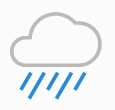
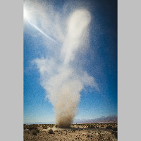
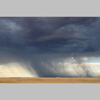
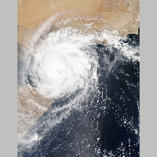
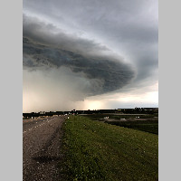
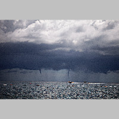

WEATHER.HTML:
-----------------------------------

<!DOCTYPE html>
<html lang="en">
  <head>
    <meta charset="UTF-8">
    <!-- Nicholas J. Corkigian, 123456789 -->
    <title>Weather</title>
    <link href="weather.css" rel="stylesheet" type="text/css">
    
  </head>
  
  <body>
    <nav>
      <ul>
        <li><a href="#">Today's Weather</a></li>
        <li><a href="#">Clouds</a></li>
        <li><a href="#">Wild Weather</a></li>
        <li><a href="#">Contact Us</a></li>
      </ul>
    </nav>
    
    <header>
      
      
      

        
        
        
      

    </header>
    
    <main>
      <section>
        <h1>Forecast</h1>

        

          <figure>
            <h4>Today</h4>
            
            15&deg;C/8&deg;C
            <h5>Cloudy</h5>
          </figure>
          
          <figure>
            <h4>Tomorrow</h4>
            
            18&deg;C/4&deg;C
            <h5>Cloudy with Thunderstorm in the morning</h5>
          </figure>
          
          <figure>
            <h4>Friday</h4>
            
            12&deg;C/6&deg;C
            <h5>Rainy all day</h5>
          </figure>
          
          <figure>
            <h4>Saturday</h4>
            
            21&deg;C/10&deg;C
            <h5>Sun with clouds</h5>
          </figure>
          
          <figure>
            <h4>Sunday</h4>
            
            24&deg;C/12&deg;C
            <h5>Sun with clouds</h5>
          </figure>
          
        

        
        <h1>Forecasting</h1>
        

          Weather forecasting is the application of science and technology 
          to predict the state of the atmosphere for a future time and a 
          given location. Human beings have attempted to predict the weather 
          informally for millennia, and formally since at least the 
          nineteenth century.[27] Weather forecasts are made by collecting 
          quantitative data about the current state of the atmosphere and 
          using scientific understanding of atmospheric processes to project 
          how the atmosphere will evolve.
        

        
        

          Once an all-human endeavor based mainly upon changes in barometric 
          pressure, current weather conditions, and sky condition, forecast 
          models are now used to determine future conditions. On the other 
          hand, human input is still required to pick the best possible 
          forecast model to base the forecast upon, which involve many 
          disciplines such as pattern recognition skills, teleconnections, 
          knowledge of model performance, and knowledge of model biases.
        

      </section>

      <aside>
        <h1>Clouds</h1>
        
        

          In meteorology, a cloud is an aerosol consisting of a visible mass 
          of minute liquid droplets, frozen crystals, or other particles 
          suspended in the atmosphere of a planetary body or similar space. 
          Water or various other chemicals may compose the droplets and 
          crystals. On Earth, clouds are formed as a result of saturation of 
          the air when it is cooled to its dew point, or when it gains 
          sufficient moisture (usually in the form of water vapor) from an 
          adjacent source to raise the dew point to the ambient temperature.
        

        <h1>Cloud Types</h1>
        
        <ol>
          <li>Stratiform</li>
          <li>Cirriform</li>
          <li>Stratocumuliform</li>
          <li>Cumuliform</li>
          <li>Cumulonimbiform</li>
        </ol>
      </aside>
      
      <article>
        <h1>Wild Weather</h1>
        
        

          <figure>
            
            <figcaption>Dust Storm</figcaption>
          </figure>
          
          <figure>
            
            <figcaption>Tornado</figcaption>
          </figure>
          
          <figure>
            
            <figcaption>Rain Storm</figcaption>
          </figure>
          
          <figure>
            
            <figcaption>Lightning</figcaption>
          </figure>
          
          <figure>
            
            <figcaption>Hurricane</figcaption>
          </figure>
          
          <figure>
            
            <figcaption>Rain Storm</figcaption>
          </figure>
          
          <figure>
            
            <figcaption>Tornadoes</figcaption>
          </figure>
          
        

      </article>
    </main>
    
    <footer>
      
      
      

        <h4>Contact Us</h4>
        Email 
        Phone
          
        <h4>Apps</h4>
        WeatherNow iOS 
        WeatherNow Android
      

      
      

        <h4>Support</h4>
        FAQs 
        Privacy Policy 
        Terms of Use
      

      
      

        <h4>Social</h4>
        Facebook 
        Twitter 
        weather@example.com
      

      
      
    </footer>
  </body>
</html>

---------------
CSS:
@charset "utf-8";

/* Nicholas J. Corkigian, 123456789 */

*
{
  box-sizing: border-box;
  margin: 0px;
  padding: 0px;
  list-style-type: none;
  text-decoration: none;
}

body
{
  font-family: Arial, Helvetica, Verdans, sans-serif;
  min-width: 620px;
}

nav
{
  background-color: black;
  padding: 0px 20px;
  position: sticky;
  top: 0px;
}

nav::after
{
  content: "";
  clear: both;
  display: table;
}

nav li 
{
  float: left;
  padding: 10px 10px;
  margin: 0px 1em;
}

nav li:hover
{
  background-color: #808080;
}

nav a 
{
  color: #fdb924;
}

nav a:hover
{
  text-decoration: underline;
}

header
{
  display: grid;
  grid-template-columns: 1fr auto;
}

header > img
{
  justify-self: center;
}

header div#social
{
  align-self: center;
}

footer
{
  background-color: #fdb924;
  display: grid;
  grid-gap: 60px;
  grid-template-columns: auto 1fr 1fr 1fr;
  padding: 20px 0px 0px 20px;
}

h4
{
  border-bottom: 1px solid black;
}

footer div img
{
  margin-right: 2px;
  vertical-align: middle;
}

